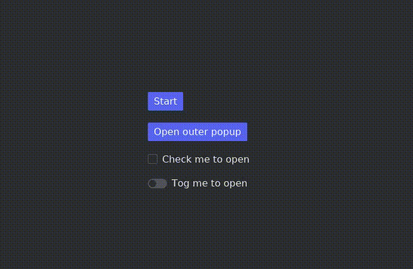

# Iced Popup Widget

A generic popup overlay widget for [Iced](https://github.com/iced-rs/iced), written in Rust.

<div align="center">
  
</div>

## Overview

`Popup` displays arbitrary content in a floating overlay anchored to any trigger widget. The trigger can be a button, checkbox, toggler, or any other element — the popup simply wraps it.

The demo application showcases several ways to open a popup:

- **Button** — click to toggle, with a nested popup inside the overlay
- **Checkbox** — checking opens the popup, unchecking closes it
- **Toggler** — toggling opens/closes the popup
- **Timer** — a subscription-driven popup that opens and closes on a 1-second interval

## Features

- Anchors to any trigger widget
- Configurable position: `Top`, `Bottom`, `Left`, `Right`, `Center`
- Adjustable gap and padding
- `on_open` / `on_close` callbacks
- `on_click_outside` callback — also fires on `Escape` key
- Optional focus trap to keep keyboard navigation inside the popup
- Supports nested popups

## Usage

```rust
Popup::new(trigger_widget, popup_content, self.is_open)
    .position(popup::Position::Bottom)
    .gap(4.0)
    .on_open(|| Message::PopupOpened)
    .on_click_outside(Message::ClickedOutside)
    .into()
```

## Dependencies

iced = { git = "https://github.com/iced-rs/iced", rev = "4255f61", features = ["advanced", "debug"] }

## Running Example

```bash
cargo run -p popup-example
```

